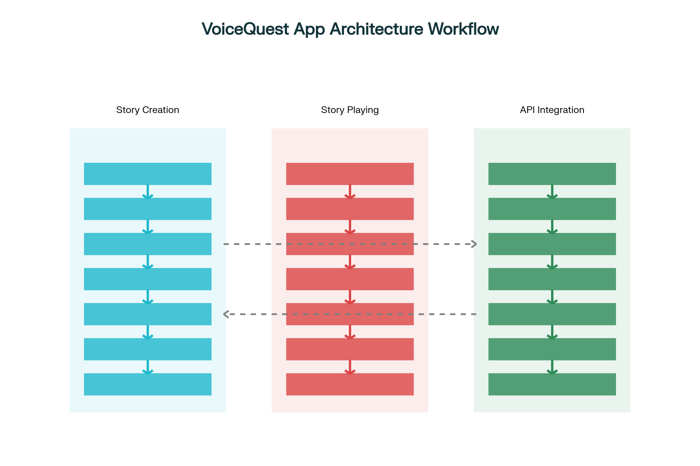

# VoiceQuest - Interactive Story Creator



VoiceQuest is a web-based interactive story creator that brings your choose-your-own-adventure stories to life with AI-generated character voices. Create, share, and experience immersive narratives with professional-quality voice acting powered by Murf AI.

## 🌟 Features

- **Interactive Story Builder**: Create branching narratives with ease
- **AI Voice Integration**: Bring characters to life with realistic AI voices
- **Multiple Genres**: Fantasy, Mystery, Sci-Fi, and more
- **Character Management**: Assign unique voices to each character
- **Story Library**: Save and organize your creations
- **Responsive Design**: Works on desktop and mobile devices

## 🚀 Getting Started

### Prerequisites
- Modern web browser (Chrome, Firefox, Safari, Edge)
- Internet connection (for AI voice generation)

### Installation
1. Clone the repository:
   ```bash
   git clone https://github.com/Haridas-Nishita/StoryQuest.git
   ```
2. Open `index.html` in your preferred web browser

## 🎮 Quick Start

1. **Create a New Story**
   - Click "Create New Story"
   - Choose a template or start from scratch
   - Add characters with unique voices
   - Build story segments with branching choices

2. **Sample Story: "The Quantum Lab Incident"**
   - Experience a pre-built sci-fi mystery
   - Multiple endings based on your choices
   - Features 4 unique AI voices

3. **Play & Share**
   - Test your story in real-time
   - Share the experience with friends
   - Export your stories

## 🎙️ Voice Integration

VoiceQuest uses Murf AI for high-quality text-to-speech. The app includes several built-in voices:

| Character | Voice ID | Description |
|-----------|----------|-------------|
| Marcus | `en-US-marcus` | Deep, authoritative male voice |
| Natalie | `en-US-natalie` | Clear, professional female voice |
| Gabriel | `en-UK-gabriel` | British male voice |
| Sarah | `en-US-sarah` | Professional female voice |
| Lily | `en-UK-lily` | Elegant British female voice |
| Jacob | `en-US-jacob` | Friendly, engaging male voice |

## 🛠️ Project Structure

```
voicequest/
├── app.js              # Main application logic
├── index.html          # Main HTML structure
├── style.css           # Styling and themes
├── chart_script.py     # Workflow visualization script
└── README.md           # This file
```

## 📚 Story Templates

1. **Fantasy Adventure**
   - Hero's journey with magical elements
   - Characters: Hero, Mentor, Villain
   - Themes: Courage, Friendship, Good vs Evil

2. **Detective Mystery**
   - Solve crimes and uncover clues
   - Characters: Detective, Suspect, Witness
   - Themes: Investigation, Deduction, Justice

3. **Space Adventure**
   - Explore the cosmos and alien worlds
   - Characters: Captain, Alien, Crew Member
   - Themes: Exploration, Technology, First Contact


## ✨ Example Story: "The Quantum Lab Incident"

Experience a thrilling sci-fi mystery where your choices determine the outcome:
- Play as Dr. Elena Vasquez, a quantum physicist
- Navigate ethical dilemmas and scientific challenges
- Multiple endings based on your decisions
- Featuring full AI voice acting


---

🎭 **Create. Share. Experience.** - Bring your stories to life with VoiceQuest
